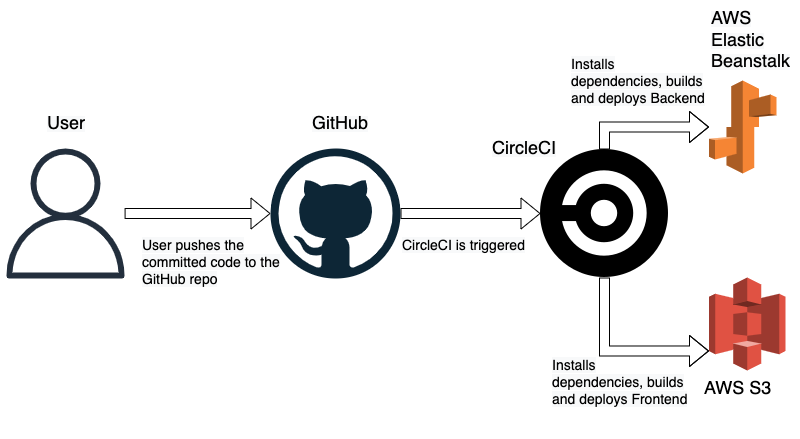

## Pipeline and How it works

With the authorization to CircleCI, CircleCI becomes able to monitor specific projects (repos) and corresponding branches in GitHub, which can be determined from it own platform. Environment variables are also should be defined there. 

In order CircleCI to start CI, it is necessary to define config.yml file in .circleci folder at the root.
Once any code commit is pushed to the specified branch for the given project, CircleCI pipeline then is triggered, which executes series of certain events:
 
 * Starts building the docker image
 * Installs the packages defined in orbs such as node, eb, etc.
 * Installs Front-End Dependencies
 * Builds the Front-End
 * Checks the code style with Lint
 * Deploys the Front-End to AWS S3 Bucket
 * Installs API Dependencies
 * Builds API
 * Deploys API to AWS Elastic Beanstalk 
 
 